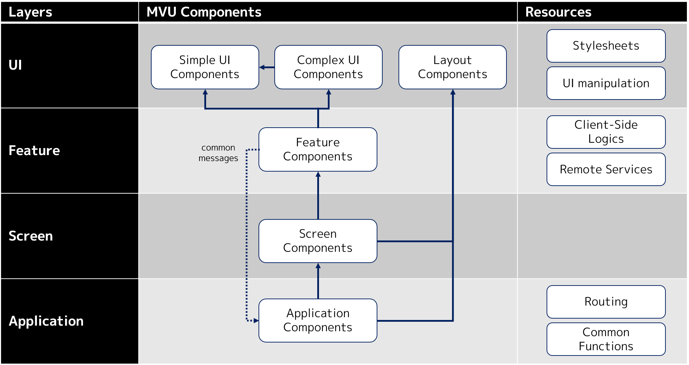

# MvuArchitecture

A sample application on MVU architecture (4-layered) using Bolero.

## Requirements

- .NET SDK 5.0.100 (or later)

## Design

[Details](https://zenn.dev/kos59125/articles/b463b153b837d2346cf0) (in Japanese)

